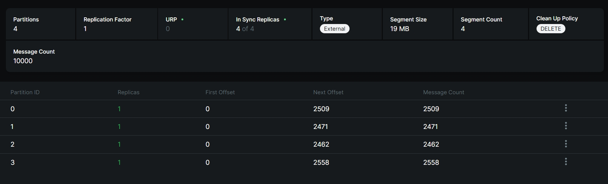

# BigDataFlink
Анализ больших данных - лабораторная работа №3 - Streaming processing с помощью Flink

---

Данный проект реализует автоматизированный цикл обработки данных: чтение сырых CSV-файлов, трансляцию событий в распределенную очередь сообщений и потоковую трансформацию данных в аналитическую модель «Звезда» (Star Schema).

## Цель работы
Демонстрация построения масштабируемой Streaming-архитектуры. Пайплайн обеспечивает преобразование плоской структуры данных в нормализованную реляционную модель в режиме реального времени.

## Архитектура решения

Решение полностью контейнеризировано и состоит из следующих модулей:

1.  **Data Producer (Python)**:
    *   Считывает 10 файлов `MOCK_DATA.csv` (10 000 строк).
    *   Обогащает данные: генерирует уникальные сквозные ID, вычисляет календарные атрибуты (день, месяц, квартал).
    *   Эмулирует поток событий, отправляя JSON-сообщения в Apache Kafka.
2.  **Message Broker (Apache Kafka)**:
    *   Обеспечивает надежное хранение событий в топике `shop_events`.
3.  **ETL Engine (Apache Flink)**:
    *   **Flink JobManager & TaskManager**: Вычислительный кластер.
    *   **PyFlink Processor**: Потоковое приложение, которое «на лету» распределяет данные из одного JSON-пакета по 7 целевым таблицам (1 таблица фактов и 6 таблиц измерений).
4.  **Storage (PostgreSQL)**:
    *   Целевая база данных `lab3_db`.
    *   Схема данных: **Звезда** (Star Schema).

---

## Требования
*   **Docker** и **Docker Compose**
*   **DBeaver** (или аналогичный SQL-клиент)

---

## Структура проекта
```text
.
├── docker-compose.yml       
├── data/                    # Исходники
├── producer/
│   ├── kafka_producer.py    # Скрипт генерации потока
│   ├── requirements.txt
│   └── Dockerfile           # Образ продюсера
├── flink_job/
│   ├── flink_processor.py   # ETL-логика на PyFlink
│   └── Dockerfile           # Образ Flink с JDBC и Kafka драйверами
├── sql_scripts/
│   └── init.sql             # инитка бдшки
└── README.md                
```

---

## Инструкция по запуску

### 1. Подготовка
Убедитесь, что порты **5435** (Postgres), **9092** (Kafka) и **8081** (Flink UI) свободны на вашем хосте.

### 2. Запуск инфраструктуры
Соберите и запустите все компоненты командой:
```bash
docker-compose up -d --build
```
*На этом этапе запустится база данных, брокер Kafka и начнется отправка данных продюсером.*

### 3. Проверка логов
Подождите 2 минуты и пропишите команду для получения логов о партициях:
```bash
docker logs kafka_producer
```
Можно и глазами все посмотреть через [http://localhost:8080](http://localhost:8080)

### 4. Запуск Streaming-задачи
После того как контейнеры перейдут в статус `running`, запустите обработку данных во Flink:
```bash
docker exec -it flink_jobmanager flink run -py /opt/flink/flink_processor.py
```

---

## Проверка результатов

### Визуальный контроль
Откройте [http://localhost:8081](http://localhost:8081) для доступа к Dashboard Apache Flink. Убедитесь, что задача находится в статусе **RUNNING**.

### Проверка данных (SQL)
Подключитесь к PostgreSQL через DBeaver:
*   **Хост:** `localhost`
*   **Порт:** `5435`
*   **База данных:** `lab3_db`
*   **Пользователь/Пароль:** `postgres` / `postgres`

**Контрольный запрос на проверку наполнения (Star Schema):**
```sql
SELECT 'fact_sales' as tbl, count(*) FROM fact_sales
UNION ALL SELECT 'dim_customer', count(*) FROM dim_customer
UNION ALL SELECT 'dim_product', count(*) FROM dim_product
UNION ALL SELECT 'dim_store', count(*) FROM dim_store
UNION ALL SELECT 'dim_seller', count(*) FROM dim_seller
UNION ALL SELECT 'dim_supplier', count(*) FROM dim_supplier
UNION ALL SELECT 'dim_date', count(*) FROM dim_date
ORDER BY 2 DESC;
```
*Ожидаемый результат: 10 000 строк в таблице `fact_sales`.*

### Остановка проекта
Для удаления всех ресурсов и очистки данных выполните:
```bash
docker-compose down -v
```

## Анализ стратегий партицирования Apache Kafka

В рамках проекта продемонстрировано два сценария балансировки нагрузки в топике `mock_data` (4 партиции).

### Сценарий А: Распределение без ключа (Default / Sticky Partitioner)



**Нагрузка по партициям:**
* Партиция 0: 2509 сообщений
* Партиция 1: 2471 сообщений
* Партиция 2: 2462 сообщений
* Партиция 3: 2558 сообщений

**Анализ:**
При отправке сообщений без явного ключа (`key=None`), Kafka берет на себя ответственность за балансировку. Библиотека `kafka-python` распределяет данные таким образом, чтобы сбалансировать размер передаваемых батчей. Поскольку JSON-строки имеют разный размер в байтах (из-за разной длины имен, названий продуктов и email), мы видим небольшой разброс в количестве самих сообщений. Алгоритм стремится выровнять объем переданных данных (LeastBytes/Sticky Partitioner), а не штучное количество строк.

---

### Сценарий Б: Семантическое распределение по ключу (Hash Partitioner)


В данном сценарии в качестве ключа партицирования был выбран бизнес-атрибут — **`store_id` (ID магазина)**.

**Нагрузка по партициям:**
* Партиция 0: 2526 сообщений
* Партиция 1: 2426 сообщений
* Партиция 2: 2535 сообщений
* Партиция 3: 2513 сообщений

**Анализ:**
При передаче ключа Kafka применяет алгоритм хэширования (`murmur2(key) % num_partitions`). 
Такой подход дает строгую гарантию: **все чеки и события одного конкретного магазина всегда попадают строго в одну и ту же партицию**. Это критически важное свойство (Order Guarantee) для последующей потоковой аналитики, так как позволяет обрабатывать историю конкретного объекта последовательно.

Небольшой перекос в цифрах (skew) является абсолютно нормальным поведением для реальных систем (Data Skew). Он обусловлен двумя факторами:
1. Хэш-функция распределяет ограниченное количество уникальных магазинов по 4 "корзинам" (партициям).
2. Разные магазины генерируют разное количество продаж.
При стремлении количества уникальных магазинов к бесконечности распределение будет стремиться к равномерному.